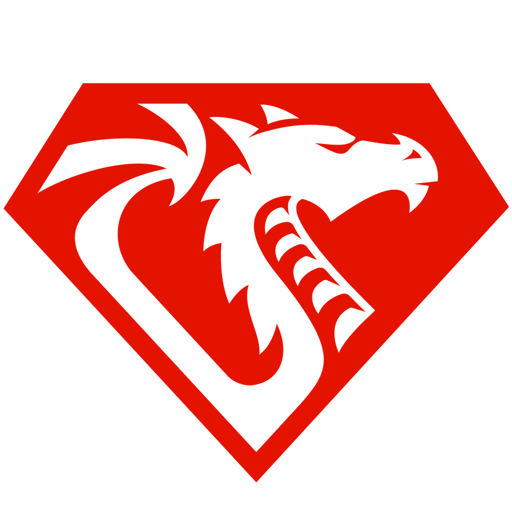

# DragonRuby game template

A starter for [DragonRuby Game Toolkit](https://dragonruby.org/toolkit/game) games.
[Get DragonRuby](https://dragonruby.org/toolkit/game#purchase) · [Docs](https://docs.dragonruby.org/#/) · [Samples](https://samples.dragonruby.org) · [Discord](https://discord.dragonruby.org)

Tested with **DragonRuby 7.18** (Standard, build of 2026-09-11).

Scene loop (splash → menu → game with pause), settings (volume / window / fullscreen, saved), keyboard + pad input,
sound helpers, JSON data loading, RuboCop config for mruby, tests, and a CLAUDE.md + skills for Claude Code.

## Start a new game

1. Unzip a fresh DragonRuby SDK, open its `mygame/`, then unzip this zip inside it.
2. `cd mygame && git init`
3. Edit `metadata/game_metadata.txt` (`gameid`, `gametitle`), swap `metadata/icon.png`, and the title in `MenuScene.new`.
4. Replace `app/scenes/play_scene.rb` with your game.

## Run

From the SDK folder: `./dragonruby mygame` · tests: `./dragonruby mygame --test tests/<file>.rb` · lint: `rubocop` from `mygame/`.

## What's where

| File | What |
|---|---|
| `app/main.rb` | `boot` / `tick` / `reset`, requires |
| `app/game.rb` | owns the scene, switches at end of tick, pause menu (Esc) |
| `app/scenes/` | `SplashScene` → `MenuScene` → `PlayScene` (placeholder) |
| `app/controls.rb` | keyboard + pad presses as one hash |
| `app/sound.rb` | `Sound.play` (random variant from `data/sounds.json`, pan, pitch), `Sound.loop` |
| `app/settings.rb`, `app/ui/settings_menu.rb` | player options saved to `settings.txt` |
| `app/ui/` | `Buttons` (mouse + keys + pad), `TextBox`, `Dim` |
| `app/json_file.rb` | `JsonFile.load` with symbol keys |
| `.claude/skills/` | `convert-audio`, `probe-scene` |

Font: `fonts/monogram.ttf` ([monogram](https://datagoblin.itch.io/monogram) by datagoblin, CC0).
Icon: `metadata/icon.png` is the DragonRuby logo the SDK ships with; replace it with your game's icon.
